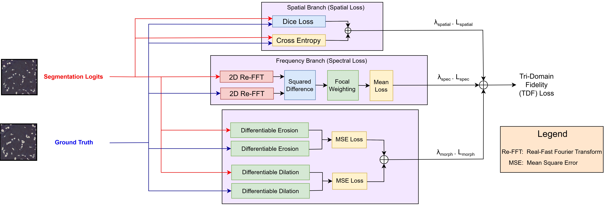

# SAGED-Net: Structural Adaptive Gated Encoder-Decoder Network

> **A lightweight, parameter-efficient framework for robust nuclei segmentation in histopathology images.**

---

## Overview

**SAGED-Net** is a deep learning framework designed to address the challenges of nuclei segmentation in digital pathology, such as overlapping boundaries, noise sensitivity, and high computational costs.

Unlike standard U-Net architectures that rely on rigid skip connections, SAGED-Net introduces a **Learnable Adaptive Gating mechanism** to actively suppress background artifacts and selective feature fusion. Coupled with a novel **Tri-Domain Fidelity (TDF) Loss**, it enforces anatomical accuracy across spatial, spectral, and morphological domains.

### Key Features

- **Parameter Efficient:** Only **3.79M** parameters (vs. ~31M for U-Net), making it suitable for resource-constrained environments.
- **Adaptive Gating:** Replaces static skip connections with learnable gates to filter noise.
- **Tri-Domain Loss:** Optimizes segmentation using Spatial (Dice/CE), Frequency (Focal Frequency), and Morphological (Erosion/Dilation) constraints.
- **State-of-the-Art Performance:** Outperforms heavy transformers and CNN baselines on TNBC, CPM-15, CPM-17, and PanNuke datasets.

---

## Architecture

### Network Overview

SAGED-Net features a hierarchical encoder-decoder architecture optimized for histopathology. The encoder integrates Half-Instance Normalization (HIN) blocks to handle stain heterogeneity without losing semantic content. A key innovation is the Learnable Adaptive Gating Mechanism, which replaces rigid skip connections to dynamically filter background noise and fuse multi-scale features. The decoder further refines boundaries using Squeeze-and-Excitation (SE) modules.

### Tri-Domain Fidelity (TDF) Loss

Tri-Domain Fidelity (TDF) Loss
To enforce anatomical consistency, we introduce the Tri-Domain Fidelity (TDF) Loss, which optimizes segmentation across three complementary domains:

- Spatial Domain: Ensures pixel-level accuracy via Dice and Cross-Entropy loss.

- Spectral Domain: Recovers high-frequency edge details using Focal Frequency Loss (FFT).

- Morphological Domain: Penalizes structural errors and boundary fragmentation through differentiable erosion and dilation constraints.

## 

## Dataset Setup

Please refer to [DATASET.md](DATASET.md) for detailed instructions on downloading and organizing the TNBC, CPM-15, CPM-17, and PanNuke datasets.

---
